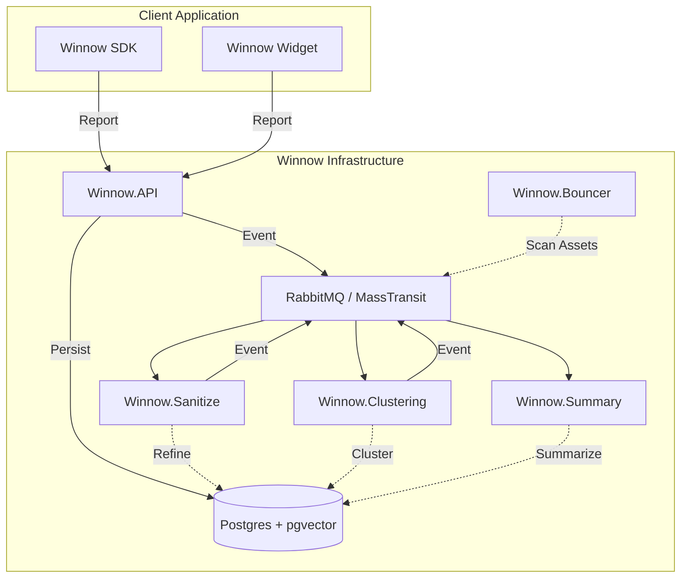

# Winnow
> Intelligent Observability & AI-Driven Issue Triaging

Winnow is an open-source platform designed to solve the "Noise Problem" in modern observability. By using AI to redact PII, cluster similar reports, and provide actionable summaries, Winnow enables engineering teams to focus on fixing bugs rather than manually triaging thousands of identical alerts.

[](./LICENSE)
[](./CONTRIBUTING.md)

---

## ✨ Key Features

- **AI-First Triaging**: Automatically groups similar reports using semantic vector matching (`pgvector`), reducing dashboard noise by up to 90%.
- **PII & Toxicity Redaction**: Native integration with `Winnow.Sanitize` ensures sensitive data never hits your long-term storage or LLMs.
- **Micro-Frontend Widget**: A sleek, custom-designed report widget for your apps that handles Proof-of-Work (PoW) security to prevent spam.
- **Event-Driven Resilience**: Built on MassTransit and RabbitMQ, ensuring that heavy AI processing never blocks your application's request/response cycle.
- **Multi-Tenant by Design**: Secure data isolation is baked into the database layer via EF Core Global Query Filters.

---

## 🏗 Architecture Overview

Winnow follows a reactive, message-based architecture centered around a "Vertical Slice" methodology.



---

## 🚀 Quick Start (Local Development)

### 1. Prerequisites
- **.NET 10 SDK** & **Node.js 18+**
- **Docker & Docker Compose**
- **Go 1.22+** (for Asset Scanning)

### 2. Spin up Infrastructure
We use Docker Compose to manage dependencies like Postgres (with vector support) and RabbitMQ.
```bash
docker compose up -d
```

### 3. Initialize the Database
```bash
cd src/Services/Winnow.API
dotnet ef database update
```

### 4. Start the Platform
Run the API and the Client Dashboard:
```bash
# In terminal 1
cd src/Services/Winnow.API && dotnet run

# In terminal 2
cd src/Apps/Winnow.Client && npm install && npm run dev
```

---

## 🛠 Technology Stack

| Layer | Technologies |
| :--- | :--- |
| **Backend** | .NET 10, FastEndpoints, MediatR, EF Core |
| **Messaging** | MassTransit, RabbitMQ |
| **AI/Vector** | pgvector, Semantic Kernel, ONNX Runtime |
| **Frontend** | React 18, Vite, Vanilla CSS |
| **Scanning** | Go (Winnow.Bouncer) |
| **Infra** | Docker, Terraform (AWS Fargate) |

---

## 🗺 Monorepo Map

- [**Winnow.API**](./src/Services/Winnow.API/README.md): The core ingestion and orchestration service.
- [**Winnow.Client**](./src/Apps/Winnow.Client/README.md): The React-based dashboard for viewing clusters.
- [**Winnow.Sdks**](./src/Sdks/README.md): Client-side libraries for easy integration.

---

## 📖 Learn More

- [**Architecture Deep Dive**](./docs/README.md)
- [**Contributing to Winnow**](./CONTRIBUTING.md)

---

## ⚖️ License

Project is licensed under the [**Functional Source License, Version 1.1 (ALv2 Future License)**](./LICENSE).

© 2026 Winnow Triage, LLC
