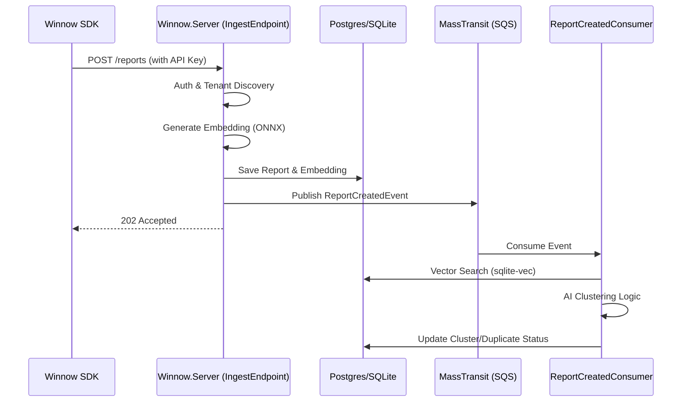

# Winnow Technical Documentation Index

Welcome to the internal technical documentation for Winnow. This document serves as the "Source of Truth" for the platform's vision, architecture, and engineering standards.

## 🎯 Product Vision

Winnow is built to solve the "Noise Problem" in modern observability. By using AI to cluster similar reports and provide actionable summaries, we enable engineering teams to focus on fixing bugs rather than triaging them.

### Core Values
- **AI-First**: AI is not a feature; it's the core methodology for report handling.
- **Tenant Isolation**: Secure, high-performance multi-tenancy is baked into the foundation.
- **Developer Experience**: SDKs and APIs are designed to be "invisible"—integrating in minutes, not days.

## 🏗 Architectural Patterns

### 1. Vertical Slice Architecture
Instead of traditional N-Tier layers, `Winnow.Server` is organized around **Features**. Each feature (e.g., `Reports.Create`) contains everything it needs to function—from endpoints to domain logic and data access.

### 2. REPR Pattern (Request-Endpoint-Response)
We use [FastEndpoints](https://fastendpoints.com/) to implement the REPR pattern. Every API interaction is a single class (the Endpoint) that takes a Request DTO and returns a Response DTO.

### 3. Native Multi-Tenancy
Multi-tenancy is achieved through a "Shared Database, Isolated Data" approach.
- **Tenant Context**: Determined per-request via API keys or session cookies.
- **Query Filtering**: EF Core Global Query Filters ensure that no user can ever see data from another organization.

### 4. Report Ingestion Workflow


## 🔐 Security & Multi-Tenancy Deep Dive

### Tenant Isolation
Isolation is enforced at the database level using EF Core Global Query Filters.
```csharp
// WinnowDbContext.cs
modelBuilder.Entity<Report>().HasQueryFilter(r => r.OrganizationId == _tenantContext.OrgId);
```
This ensures that even a `db.Reports.ToList()` call will only return reports for the current organization.

### API Key Authentication
API Keys are linked to a specific `ProjectId` and `OrganizationId`. The `ApiKeyAuthenticationHandler` validates the key and populates the `ClaimsPrincipal` with these IDs, which are then used by the `TenantMiddleware` to set the request context.

## 🛠 Technology Stack Hub

### Backend Services
- **Runtime**: .NET Core 10
- **Persistence**: EF Core, PostgreSQL (Prod), SQLite (Local/CI)
- **Messaging**: MassTransit, AWS SQS
- **AI**: Semantic Kernel, ONNX Runtime
- **Auth**: custom `Winnow.Bouncer` (Go)

### Frontend Applications
- **Library**: React 18+ (Vite)
- **Styling**: Tailwind CSS
- **Testing**: Vitest

## 📂 Navigation Map

- [**Application Layer**](../src/Apps/README.md): Detailed docs for Client and Marketing sites.
- [**Service Layer**](../src/Services/README.md): Deep dive into Server, Bouncer, and Integrations.
- [**SDK Layer**](../src/Sdks/README.md): Technical specs for client-side libraries.
- [**Contributing Guide**](../CONTRIBUTING.md): Onboarding and standards.
