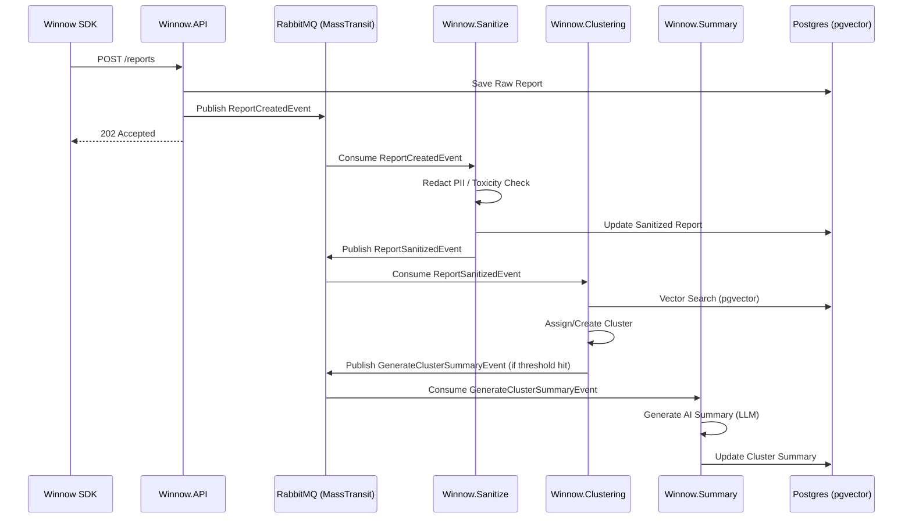

# Winnow Technical Documentation Index

Welcome to the internal technical documentation for Winnow. This document serves as the "Source of Truth" for the platform's vision, architecture, and engineering standards.

## 🎯 Product Vision

Winnow is built to solve the "Noise Problem" in modern observability. By using AI to cluster similar reports and provide actionable summaries, we enable engineering teams to focus on fixing bugs rather than triaging them.

### Core Values
- **AI-First**: AI is not a feature; it's the core methodology for report handling.
- **Tenant Isolation**: Secure, high-performance multi-tenancy is baked into the foundation.
- **Developer Experience**: SDKs and APIs are designed to be "invisible"—integrating in minutes, not days.

## 🏗 Architectural Patterns

### 1. Vertical Slice & Microservices
Each service is organized around **Vertical Slices**. While `Winnow.API` handles the public-facing features, specialized worker services handle background processing:
- **Winnow.API**: Ingestion, Dashboard, and Identity.
- **Winnow.Sanitize**: PII Redaction and Toxicity Detection.
- **Winnow.Clustering**: Report grouping and vector matching.
- **Winnow.Summary**: AI-driven cluster summarization.
- **Winnow.Bouncer**: Assets/Media scanning (Go-based).

### 2. Event-Driven Asynchrony (MassTransit)
We use a reactive, message-based architecture. No heavy AI processing happens in the request/response cycle.



### 3. Native Multi-Tenancy
Multi-tenancy is enforced through a "Shared Database, Isolated Data" approach.
- **Tenant Context**: Determined per-request via API keys or session cookies.
- **Query Filtering**: EF Core Global Query Filters ensure that no user can ever see data from another organization.

## 🔐 Security & Multi-Tenancy Deep Dive

### Tenant Isolation
Isolation is enforced at the database level using EF Core Global Query Filters.
```csharp
// WinnowDbContext.cs
modelBuilder.Entity<Report>().HasQueryFilter(r => r.OrganizationId == _tenantContext.OrgId);
```

### API Key Authentication
API Keys are linked to a specific `ProjectId` and `OrganizationId`. The `ApiKeyAuthenticationHandler` validates the key and populates the `ClaimsPrincipal` with these IDs.

## 🛠 Technology Stack Hub

### Backend Services
- **Runtime**: .NET Core 10
- **Persistence**: PostgreSQL with `pgvector` for semantic search.
- **Messaging**: MassTransit with **RabbitMQ**.
- **AI**: Semantic Kernel, ONNX Runtime (Local Embeddings).
- **Media Scan**: `Winnow.Bouncer` (Go).

### Frontend Applications
- **Library**: React 18+ (Vite)
- **Styling**: Vanilla CSS (Premium Custom Design)
- **State**: TanStack Query

## 📂 Navigation Map

- [**Application Layer**](../src/Apps/README.md): Detailed docs for Client and Marketing sites.
- [**Service Layer**](../src/Services/README.md): Deep dive into Server, Bouncer, and Integrations.
- [**SDK Layer**](../src/Sdks/README.md): Technical specs for client-side libraries.
- [**Contributing Guide**](../CONTRIBUTING.md): Onboarding and standards.
